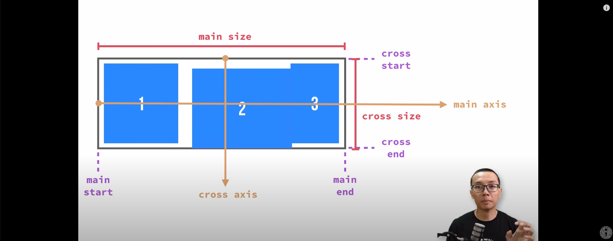

# Flexbox

*** "Model layout **1 dimensi** yang dapat mengatur jarak dan penjajaran antar item dalam sebuah container"  ***

***-MDN***

* 1 Dimensi
**"Hanya dapat mengatur 1 dimensi pada saat tertentu, antara baris atau kolom, tidak bisa keduanya sekaligus"**

## Istilah di Flexbox

* **main axis** - Sumbu utama dari sebuah container yang menentukan urutan dari penempatan items secara horizontal
* **main-start | main-end** - Mulai dan berakhirnya items yang disimpan di dalam container
* **main size** - Ukuran(width/height) dari container yang akan membuat dimensi dari items nya relatif terhadap main size 

* INI TEST MERGE BRANCH DEH
